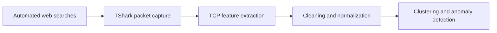

# ML4N

## Unsupervised learning for network-traffic characterization

ML4N is an experimental machine-learning pipeline for studying whether statistical patterns in TCP traffic can reveal meaningful structure about web-browsing activity.

The project generates controlled browsing sessions in Chrome, Edge, and Firefox, captures the resulting network traffic with TShark, extracts flow-level features, and analyzes the resulting dataset using dimensionality reduction, clustering, and anomaly detection.

The central question is:

> Can traffic-flow statistics form clusters that correspond to the browser, destination website, or search-query category—even when the application payload is not inspected?

This repository is a research/course prototype rather than a production-ready network-classification system.

## Experimental design

The current experiment combines:

- **Browsers:** Chrome, Edge, and Firefox
- **Websites:** Google, Bing, and Wikipedia
- **Queries:** Machine Learning, Deep Learning, Python, Quantum Computing, and Italy
- **Repeated sessions:** multiple repetitions of each browser–website–query combination

Selenium automates the searches so that browsing behavior is reasonably consistent across experiments. TShark records TCP traffic on ports 80 and 443, and the resulting packet captures are converted to CSV files for feature extraction.

## Pipeline



### 1. Traffic generation

The Selenium scripts reproduce searches across the selected browsers and websites. The experiment metadata records the browser, website, query, and repetition identifier associated with every session.

### 2. Packet capture and conversion

`run_tshark.bat` captures HTTP/HTTPS TCP traffic to a PCAP file. `pcap_to_csv.bat` then uses TShark to export selected packet fields to CSV.

The captured fields include:

- TCP stream identifier, source port, destination port, flags, sequence number, acknowledgment number, and window size
- Source and destination IP addresses
- Frame length and TCP payload length
- IP time to live (TTL)

### 3. Stream-level feature extraction

Packets are grouped by TCP stream, and statistical descriptors are computed for each stream. These include:

- Mean and standard deviation of frame length
- Mean and standard deviation of TCP length
- Mean and standard deviation of TCP window size
- Mean and standard deviation of sequence and acknowledgment numbers
- Mean and standard deviation of IP TTL
- Packet count, stream count, representative TCP port, and number of unique TCP flags

The browser, website, query, and repetition ID are retained as metadata for evaluating the unsupervised results.

### 4. Preprocessing and dimensionality reduction

The preprocessing stage:

1. Cleans missing and invalid values.
2. Removes address fields that should not be used as identifying features.
3. Aggregates samples by browser, website, query, and repetition.
4. Standardizes numerical features with `StandardScaler`.
5. Selects features using interquartile-range overlap between metadata categories.
6. Removes strongly correlated features.
7. Applies principal component analysis (PCA) for two-dimensional analysis and visualization.

### 5. Unsupervised analysis

The main analysis notebook compares:

- **K-means clustering**
- **Agglomerative hierarchical clustering**

Cluster structure is assessed using silhouette scores, contingency tables, adjusted Rand index, and normalized mutual information. Because the algorithms are unsupervised, the browser, website, and query labels are used only after clustering to measure coherence—not to train the models.

The project also evaluates three approaches to outlier removal:

- Z-score thresholding
- Isolation Forest
- DBSCAN

The current notebook reports that K-means is qualitatively more coherent with the metadata than hierarchical clustering for the tested browser experiment. In particular, the hierarchical result shows confusion involving Edge. This observation is exploratory and specific to the collected dataset.

## Repository structure

| File or group | Purpose |
|---|---|
| `websites_behaviors_new.py` | Generates the browser–website–query experiment matrix |
| `main_search.py` | General Selenium-based search automation |
| `chrome.py`, `edge.py`, `firefox.py` | Browser-specific automation scripts |
| `run_tshark.bat` | Captures TCP traffic with TShark |
| `pcap_to_csv.bat` | Extracts packet fields from PCAP into CSV |
| `csv_analysis.py` | Computes per-stream traffic statistics |
| `merge_csv.py` | Combines analyzed experiment files |
| `pre_processing.ipynb` | Cleans, aggregates, and standardizes the dataset |
| `main_unsupervised.ipynb` | Performs feature selection, PCA, clustering, evaluation, and anomaly detection |
| `visualize.py` | Visualizes PCA-reduced data |
| `*_brows_sim.py`, `chrome_final.py` | Earlier or experimental browser-automation variants |

## Requirements

The traffic-collection scripts are currently designed for Windows. The analysis notebooks can run on any platform with a compatible Python environment.

### Software

- Python 3
- Jupyter Notebook or JupyterLab
- Wireshark/TShark
- Chrome, Edge, and Firefox
- Selenium-compatible browser drivers

### Python packages

```bash
python -m venv .venv
.venv\Scripts\activate
pip install pandas numpy scipy matplotlib seaborn scikit-learn selenium jupyter
```

On Linux or macOS, activate the environment with:

```bash
source .venv/bin/activate
```

## Running the experiment

There is not yet a single portable command for the complete pipeline. The current workflow is:

1. Run `websites_behaviors_new.py` to generate `websites_behaviors.csv`.
2. Configure the network interface and output path in `run_tshark.bat`.
3. Start TShark capture in a separate terminal.
4. Run `main_search.py` or the browser-specific automation scripts.
5. Stop the capture after the browsing sessions finish.
6. Convert each PCAP file using `pcap_to_csv.bat`.
7. Run `csv_analysis.py` and `merge_csv.py` to construct the stream-level dataset.
8. Run `pre_processing.ipynb` to create the standardized dataset.
9. Run `main_unsupervised.ipynb` to perform PCA, clustering, evaluation, and anomaly detection.

Before running the collection pipeline, replace the hard-coded Windows paths and repetition settings with values appropriate for your system.

## Interpretation and limitations

- The results describe one controlled capture environment and should not be interpreted as universal browser or website fingerprints.
- Network conditions, operating system behavior, browser versions, caching, background traffic, TLS evolution, and website changes can all affect the features.
- Search-engine page structure and cookie dialogs may change, requiring updates to the Selenium selectors.
- The repository contains several exploratory and earlier script variants; the notebooks represent the clearest record of the final analysis workflow.
- Raw captures and processed experiment datasets are not currently included, so reproducing the results requires collecting new traffic or supplying compatible CSV files.

## Responsible use

Capture only traffic generated by systems and networks that you own or are explicitly authorized to monitor. This project is intended for controlled experimentation and education; it should not be used to monitor third-party browsing activity without informed authorization.

## Author

Shaghayegh Samadzadeh, Politecnico di Torino
